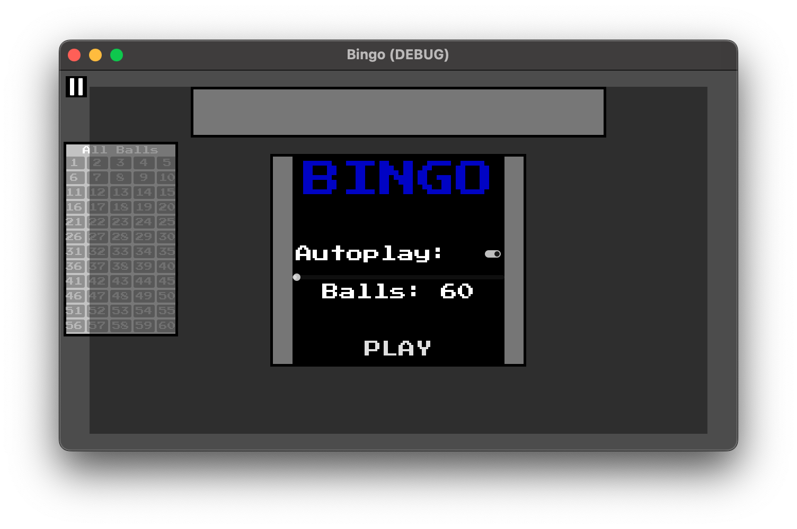
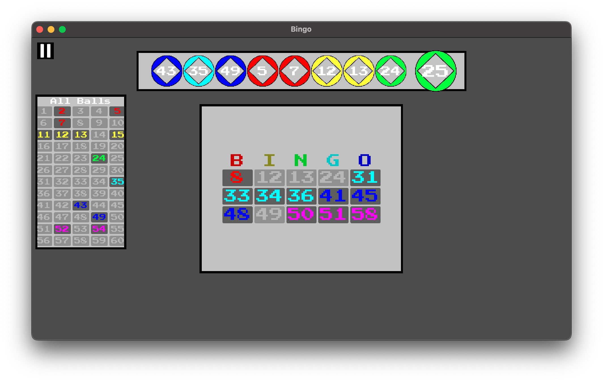
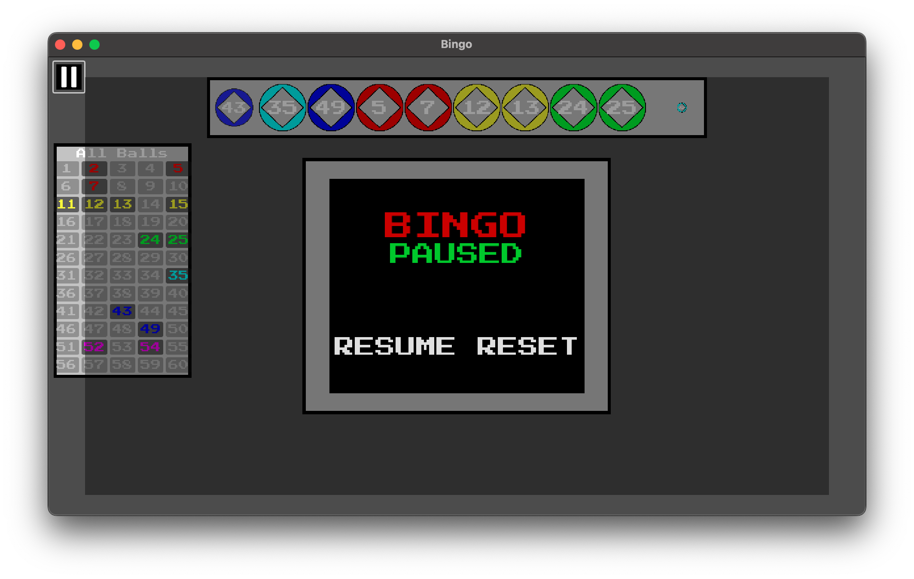
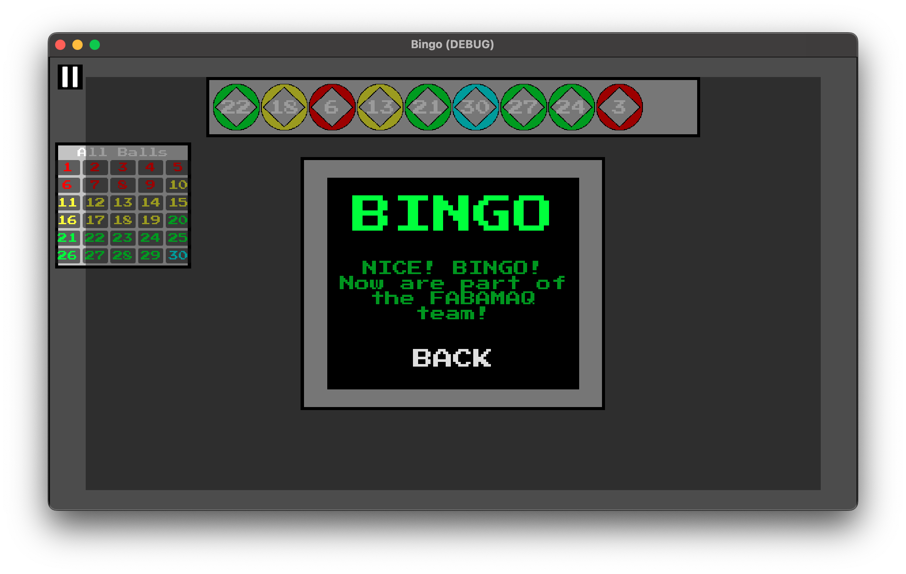
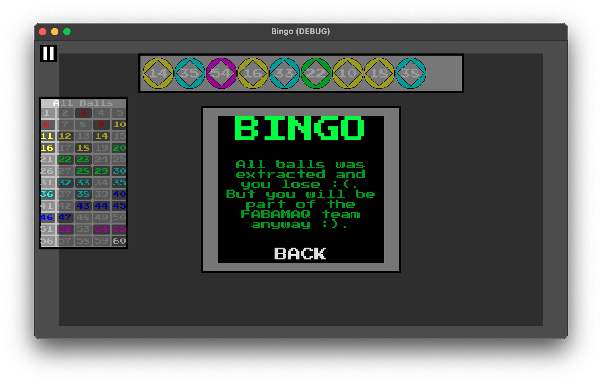

# Bingo Game in Godot

## Description

This is a Bingo game created for the FABAMAQ 1 week challenge. This game was developed with Godot 4.2.

## Preview

### YouTube Video

### Main Menu

This is the main menu, and the player can select between autoplay (the game will mark the numbers automatically), or manual play. And the player can select the range of the balls, between 60 and 90.

After clicking on the play button the game will start.

### Game

This is the game, were the magic happens, the extraction of the ball every 3 seconds.

The player can view the last 10 balls extracted on the top of the screen. On the left, the player can see all the extracted balls and the ones left to extract.

At the center of the screen, the player has the player card. If the game is on manual mode, the player has to click on the button after ball is extracted. If it's on autoplay, after the extraction animation the computer will mark automatically.

### Pause Menu

The player can pause the game and access the pause menu by clicking on the pause button, or on the `esc` key.

In this menu, the player can resume game (same as clicking on the `esc` key) or restart the game, and will be moved to the [Main Menu](#main-menu).

### End Game Menus

**Win**

**Lose**

After all balls are extracted:
- If the player marked all balls on his card: Win screen will show up;
- Else: Lose screen will show up;

## Game Concept

### Rules

- The game is based on a set of uniquely numbered balls and at least one card with a set of unique numbers;
- In each round, some balls are drawn, and their numbers are marked on the cards that contain those numbers;
- The goal is to mark all the numbers on the card, forming prize patterns, with the highest being a full "bingo";

### Technical Detail

- Balls

  - 30 balls, each with a different number (default range from 1 to 60);
  - The balls have different colors, organized in groups of 10 (e.g., balls 1 to 10 are blue, 11 to 20 are red, etc.);
  - At the start of the draw, the balls follow a linear path from the right to the left of the screen, with a small margin on both sides;
  - The balls leave a time interval between them, and the complete draw animation lasts about 3 seconds. The paths should not overlap;
  - Upon reaching the end of the path, two possible sounds are played: one if the number is on the card and another if it is not;

- Card

  - The card must have a matrix of unique numbers (same range as the balls);
  - The matrix should be displayed in a 3x5 format, and the numbers should be ordered;
  - When a ball reaches the end of the path, if the number is on the card, it should be marked in a different color;

- Play Button
  - Starts the process of drawing balls without the need for further user interactions;
  - Pauses the drawing and animation of the balls when clicked again, and resumes when clicked once more;
  - Resets the game when the drawing ends (balls return to their original position, marks on the card are cleared, new numbers are generated, etc.) and starts a new game with randomized balls and numbers;

## Devolopment

| Category             | Tools         |
| -------------------- | ------------- |
| Game Engine          | Godot V4.2.2  |
| Programming Language | GD Script     |
| Version Control      | Git/GitHub    |
| Task Manager         | GitHub Issues |

### Project Conventions

In this project I tried to follow some of the official best practices:

- https://docs.godotengine.org/en/stable/tutorials/scripting/gdscript/index.html
- https://docs.godotengine.org/en/stable/tutorials/best_practices/index.html

And I tried to follow most of the roles implemented in other game made by me and some friends: [Olympus Gone Wild - Project Best Practices](https://github.com/FlamingoFiestaStudio/OlympusGoneWild/wiki/ProjectBestPractices)

### Assets Reference

### Fonts

- [Google Fonts - Press Start 2P](https://fonts.google.com/specimen/Press+Start+2P);

#### Sound

- [Sfxr.me](https://sfxr.me/);
  - [PickCoin](https://sfxr.me/#34T6PkntbT2sPpbmSdLFDELp8y1kb4VawKK94uMgoA5tpbEfxkuFCncQ37qaDFr13PE72UGGhAFbTZhHVCMSqQZGgV81iYbzxnR3Epg5APmbv6CRbMA8Y1ucs);
  - [HasBall](https://sfxr.me/#34T6PkkMojo6d3YifwWNNFATMy28KAwRx9Va9yT5Z5rNKVFvyGNHnKR9H8PuYnykfT3FX5ttpLoT7JqXS4N3FxjGnet41axKYYVU7HqYtdyyefBG4tdjNfcmV);
  - [NoHasBall](https://sfxr.me/#111116wGFWgc4XCLFSkQ7hGSXiiQM3FSF7f817ta9LYaXDJVErQsKjMLUBVkeaLaE2WxufKhAbU2dNXLkgAWUQgrPAzA8SZ6eB2bmjF8P9TbfFJY12isT4RM);

#### Sprites

- [pause-button](https://game-icons.net/tags/gui.html);

## Final notes

This project was developed as part of the proposed challenge. I am deeply grateful for the opportunity to participate and showcase my skills. I learned a lot with this project, and I'm kinda proud of the final result.
